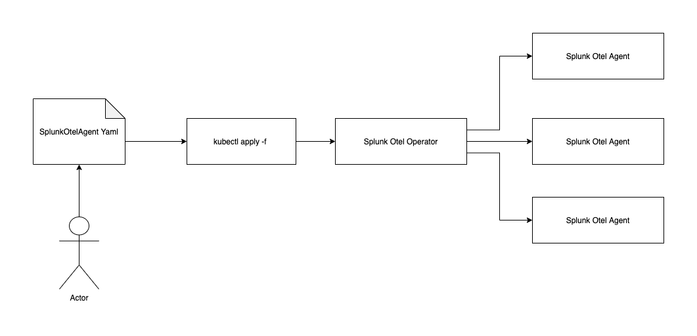
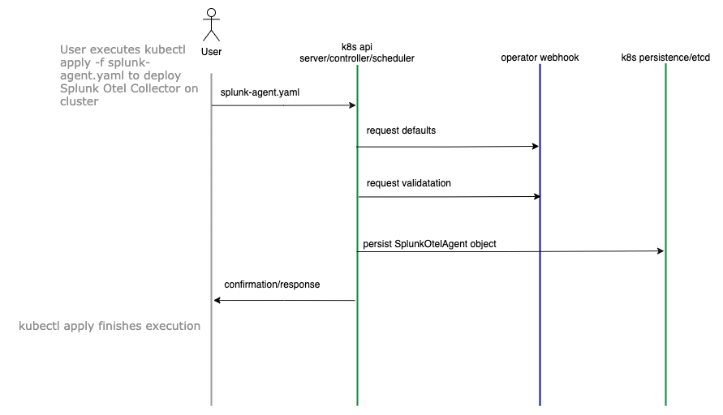
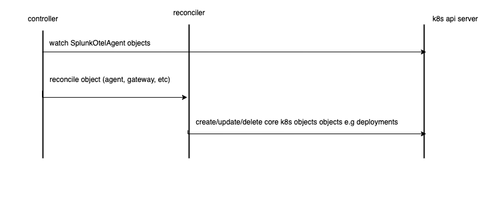

# Overview 

Splunk OpenTelemetry Collector Operator is a Kubernetes Operator designed to support deployment/management of Splunk OpenTelemetry Collector (and other Splunk Agents) on Kubernetes. The operator ships with high level Kubernetes API objects that abstract OpenTelemetry collector and tries to contain the complexity. The operator is not a general purpose OpenTelemetry operator but caters to Splunk customers only and as such tries to replicate all the features of the Spluk OpenTelemetry Collector Helm Chart (github.com/signalfx/splunk-otel-collector-chart). It is a goal to have feature parity between the Operator and the Chart.

## Design



At it's core, the operator is an always-on Go service running on a Kubernetes cluster. It is mainly comprised of a [custom resource definitions](https://kubernetes.io/docs/concepts/extend-kubernetes/api-extension/custom-resources/), an [admission/validating webhook](https://kubernetes.io/docs/reference/access-authn-authz/extensible-admission-controllers/) and a [controller](https://kubernetes.io/docs/concepts/architecture/controller/).

The custom resource definition allows us to register SplunkOtelAgent as a valid object with the Kubernetes API. This allows users to decleratively create/manage/delete SplunkOtelAgent objects with kubectl and YAML just like core Kubernetes objects such as deployments instead of managing multiple objects like deployments, daemonsets, services, configmaps, etc.

The webhook facilitates processing and validation of the user provided SplunkOtelAgent definition. This is where we place our custom logic to set default values or validate and accept/reject user provided input. Any validated and accepted objects are persisted by Kubernetes.

The controller watches persisted SplunkOtelAgent objects and tries to being the state of the cluster closer to the desired state. For example, it watches SplunkOtelAgent objects and tries to create/update/delete the corresponding deployments, daemonsets, services, configmaps, etc in response to any changes to SplunkOtelAgent objects.


## API or custom resource definitions

The operator introduces SplunkotelAgent custom resource definition. Users can decleratively manage Splunk OpenTelemetry Collector via this custom resource as follows:

```yaml
apiVersion: otel.splunk.com/v1alpha1
kind: Agent
metadata:
  name: splunk-otel
spec:
  clusterName: <MY_CLUSTER_NAME>
  realm: <SPLUNK_REALM>
```

`clusterName` and `realm` are the only two required fields. Other than these, SplunkOtelAgent also accepts some optional fields that allow customization of agents, gateway and cluster receiver. The entire schema is detailed [here](../agent_cr_spec.md) and source of truth can be located [here](../../apis/otel/v1alpha1/agent_types.go).

## Webhook



The admission webhook is called synchronously when a user creates/applied/deletes a SplunkOtelAgent object. The webhook has two responsibilities: it sets default values on SplunkOtelAgent objects and it validates user provides values, returning errors for values that don't make sense. Such errors are directly reported back to end users by CLI tools like kubectl. Once a SplunkOtelAgent object is validated to be correct, it is automatically persisted by the cluster for controllers to manage. Webhook source code can be found [here](../../apis/otel/v1alpha1/agent_webhook.go). 

## Controller & Reconcilers



The controller watches SplunkOtelAgent objects present in the cluster and creates, updated or deletes any other kubernetes objects that derive from the SplunkOtelAgent object. Specifically, it creates a Daemonset to be deployed on every node (agent), a Deployment with replica count always set to 1 (cluster receiver) and a Deployment with scalable replica count set to 1 by default. The controller also controls any supporting objects such as configmaps or services. Internally the controller divides the SplunkOtelAgent into smaller work items and hands them off to reconciler functions. Each reconciler function is only responsible for reconciling a single object type. A reconciler receives SplunkOtelAgent object (or a part of it), figures out what kubernetes objects it needs to create in response, queries the kubernetes API for existing objects, computes the diff and then creates/updates/deletes kubernetes objects as required. Controller source can be found [here](../../controllers/) and reconcilers can be found [here](../../internal/collector/reconcile). 

### Secrets

SplunkOtelAgent has an implicit dependency on a secret with name `splunk-access-token` in the `splunk-otel-operator-system` namespace. If this secret is not present, the agents will be not be able to start. Presently we expect users to manually create and manage secrets. We should consider adding the following couple of features:

1. Perhaps webhook should use k8s API to check if the given secret is present or not and return an error if none is found. We should ensure it is not a bad practice to make k8s API calls from within the validating webhook.
2. Allow users to specify their Splunk Access Tokens as part of SplunkOtelAgent decleration. Once we do this, the secret will be stored as plain text as part of the SplunkOtelAgent definition by Kubernetes. This should be called out in documentation.

### Namespaces

The operator only supports deploying to a namespace called `splunk-otel-operator-system` right now. Support for deploying to custom namespace can be easily added if desired.

### RBAC

Most permissions (RBAC) the controller needs are auto-generated by the operator-sdk but our agents need some additional permissions. These permissions are manually defined and managed [splunk_role.yaml](../../config/rbac/splunk_role.yaml) and [splunk_role_binding.yaml](../../config/rbac/splunk_role_binding.yaml) files. The build system automatically bundles these files into the operator distribution and ensures they get installed alongside the operator.

## OpenShift Support

### OpenTelemetry Config

We supports OpenShift out of the box. This means that the operator must be smart enough to detect it is running on OpenShift and then apply OpenShift specific configuration to the deployed agents. Today vanilla Kubernetes and OpenShift deployments only have a single difference i.e, conditional configuration of the `k8s_cluster` receiver handled by webhook's `defaultClusterReceiver()` method [here](../../apis/otel/v1alpha1/agent_webhook.go).

### SecurityContextConstraints

In addition to RBAC rules, the agent deployed by the operator also needs some additional OpenShift specific SecurityContextConstraints to work correctly. These constraints are applied at install time along with the operator just like RBAC rules but they are specific to OpenShift and don't make sense for vanilla Kubernetes. As a result, we release different distributions for OpenShift and Kubernetes. The OpenShift distribution is exactly the same as the Kubernetes one except that it bundles an [additional file](../../config/openshift/security_patch.yaml) containing the SecurityContextContraints.